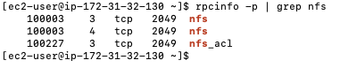
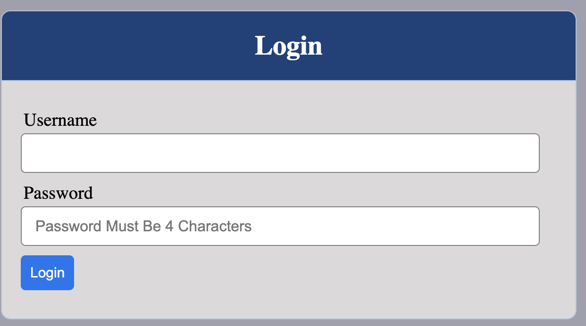

# Documentation on Project 7

1.  PREPARE NFS SERVER

- Ensure there are 3 Logical Volumes. lv-opt lv-apps, and lv-logs

- Instead of formating the disks as ext4 you will have to format them as xfs

- Create mount points on /mnt directory for the logical volumes as follow:
Mount lv-apps on /mnt/apps 
Mount lv-logs on  /mnt/logs 
Mount lv-opt on  /mnt/opt 

- Install NFS server, configure it to start on reboot and make sure it is u and running

'sudo yum -y update'

'sudo yum install nfs-utils -y'

'sudo systemctl start nfs-server.service'

'sudo systemctl enable nfs-server.service'

'sudo systemctl status nfs-server.service'

- Make sure we set up permission that will allow our Web servers to read, write and execute files on NFS:

'sudo chown -R nobody: /mnt/apps'

'sudo chown -R nobody: /mnt/logs'

'sudo chown -R nobody: /mnt/opt'

'sudo chmod -R 777 /mnt/apps'

'sudo chmod -R 777 /mnt/logs'

'sudo chmod -R 777 /mnt/opt'

'sudo systemctl restart nfs-server.service'

- Configure access to NFS for clients within the same subnet (example of Subnet CIDR – 172.31.32.0/20 )

'sudo exportfs -arv'

- Check which port is used by NFS and open it using Security Groups (add new Inbound Rule)

'rpcinfo -p | grep nfs'

2. CONFIGURE THE DATABASE SERVER

3. Prepare the Web Servers

- Install NFS client

'sudo yum install nfs-utils nfs4-acl-tools -y'

- Mount /var/www/ and target the NFS server’s export for apps

'sudo mkdir /var/www'
'sudo mount -t nfs -o rw,nosuid <NFS-Server-Private-IP-Address>:/mnt/apps /var/www'

- Verify that NFS was mounted successfully by running df -h. Make sure that the changes will persist on Web Server after reboot

'sudo vi /etc/fstab'

- Install Remi’s repository, Apache and PHP

'sudo yum install httpd -y'

'sudo dnf install https://dl.fedoraproject.org/pub/epel/epel-release-latest-8.noarch.rpm'

'sudo dnf install dnf-utils http://rpms.remirepo.net/enterprise/remi-release-8.rpm'

'sudo dnf module reset php'

'sudo dnf module enable php:remi-7.4'

'sudo dnf install php php-opcache php-gd php-curl php-mysqlnd'

'sudo systemctl start php-fpm'

'sudo systemctl enable php-fpm'

'setsebool -P httpd_execmem 1'

- Fork the tooling source code from Darey.io Github Account to your Github account.

- Deploy the tooling website’s code to the Webserver. Ensure that the html folder from the repository is deployed to /var/www/html

- Update the website’s configuration to connect to the database (in /var/www/html/functions.php file). Apply tooling-db.sql script to your database using this command 

- Open the website in your browser http://<Web-Server-Public-IP-Address-or-Public-DNS-Name>/index.php

